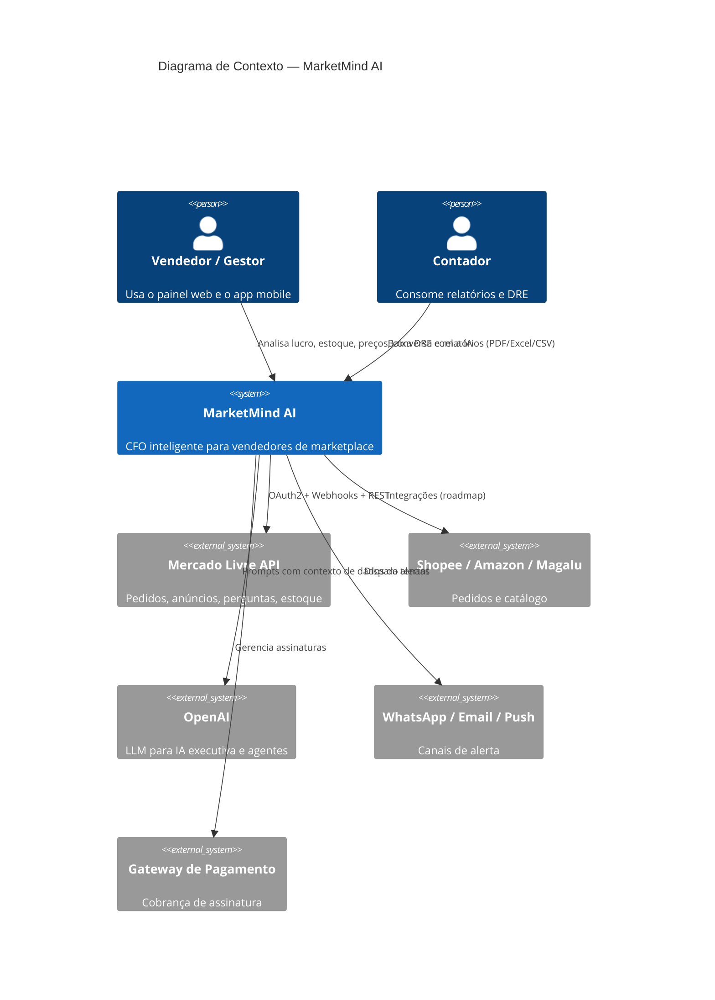
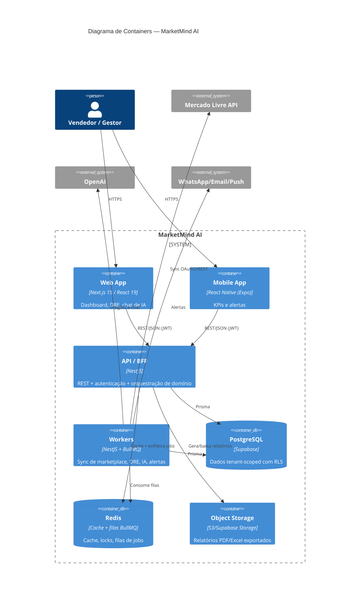
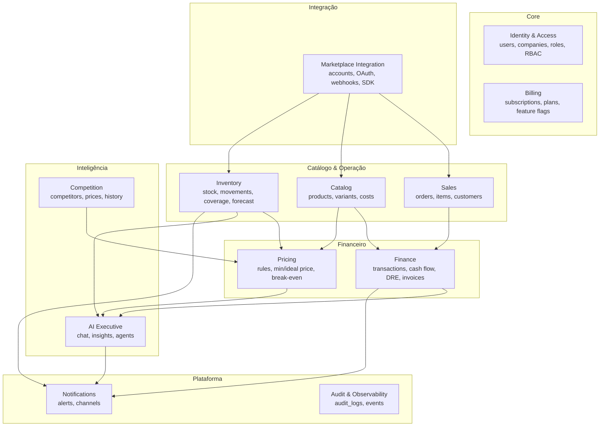
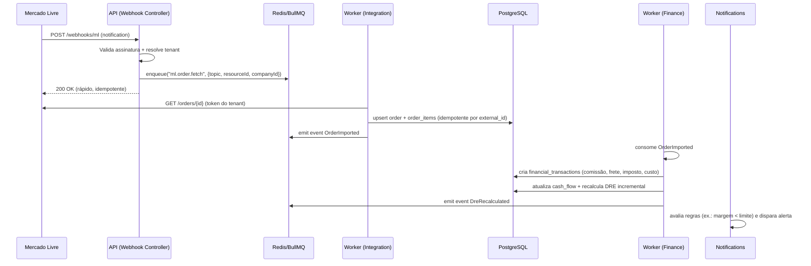

# 02 — Arquitetura

## 1. Princípios

| Princípio | Como se materializa |
|-----------|---------------------|
| **DDD** | Bounded contexts explícitos (ver §3). Linguagem ubíqua no código (`Order`, `LedgerEntry`, `StockCoverage`). |
| **Clean Architecture** | 4 camadas por módulo: `domain` → `application` → `infrastructure` → `presentation`. A regra de dependência aponta sempre para dentro. O domínio não importa Prisma, NestJS nem OpenAI. |
| **SOLID** | Interfaces (ports) no domínio; implementações (adapters) na infra. Inversão de dependência via DI do NestJS. |
| **Multi-tenant** | `company_id` em toda tabela tenant-scoped + PostgreSQL Row-Level Security. Tenant resolvido no guard de request e propagado por `AsyncLocalStorage`. |
| **Event-Driven** | Mudanças relevantes emitem eventos de domínio. Efeitos colaterais (sync, recálculo de DRE, IA, alertas) rodam assíncronos em BullMQ. |

## 2. C4 — Nível 1: Contexto



## 3. C4 — Nível 2: Containers e Bounded Contexts



## 4. Bounded Contexts (mapa de domínio)



**Regra:** contexts comunicam-se por **eventos de domínio** (assíncrono) ou por **application
services** (síncrono, somente leitura cross-context). Nunca por acesso direto a tabelas de
outro context.

## 5. Camadas por módulo (Clean Architecture)

```
modules/finance/
├── domain/                 # Entidades, value objects, eventos, ports (interfaces). ZERO deps de infra.
│   ├── entities/
│   ├── value-objects/      # Money, TaxRegime, Percentage
│   ├── events/             # OrderSettled, DreRecalculated
│   └── ports/              # LedgerRepository, TaxCalculator (interfaces)
├── application/            # Casos de uso, orquestração, DTOs. Depende só de domain.
│   ├── use-cases/          # GenerateDre, RecalculateCashFlow
│   └── dto/
├── infrastructure/         # Adapters: Prisma repos, OpenAI, BullMQ, gateways externos.
│   ├── persistence/
│   ├── queue/
│   └── external/
└── presentation/           # Controllers NestJS, validação (Zod/class-validator), guards.
    └── http/
```

**Fluxo de dependência:** `presentation → application → domain ← infrastructure`.
A infraestrutura implementa as `ports` do domínio; o NestJS faz o wiring por DI.

## 6. Fluxo crítico — Ingestão de pedido → DRE



Pontos de robustez:
- Webhook responde **rápido e idempotente**; trabalho pesado vai para fila.
- `external_id` único por (`marketplace_account_id`, `external_id`) garante idempotência.
- Tokens OAuth criptografados em repouso; refresh automático em job dedicado.

## 7. Multi-tenancy

- Toda tabela tenant-scoped carrega `company_id` (FK → `companies`).
- **PostgreSQL Row-Level Security** ativo: policy filtra por `current_setting('app.current_company')`.
- O `TenantContext` (via `AsyncLocalStorage`) injeta o `company_id` no `SET LOCAL` por transação.
- Prisma usa um middleware/extension que aplica o tenant; isso é defesa em profundidade junto da RLS.
- Workers recebem `companyId` no payload do job e abrem a transação com o contexto correto.

Ver decisão detalhada em [ADR-0002](adr/0002-estrategia-multi-tenancy.md).

## 8. Observabilidade

- **Logs** estruturados (pino) com `requestId`, `companyId`, `userId` (sem PII sensível).
- **Métricas** Prometheus (latência por rota, profundidade de fila, taxa de erro de sync).
- **Tracing** OpenTelemetry ponta a ponta (web → api → worker).
- **Health checks** `/health` (liveness) e `/ready` (readiness com DB/Redis).

## 9. Mapeamento stack → arquitetura

| Necessidade | Tecnologia | Camada |
|-------------|-----------|--------|
| API HTTP + DI | NestJS | presentation/infrastructure |
| Persistência | Prisma + PostgreSQL | infrastructure |
| Cache/lock/fila | Redis + BullMQ | infrastructure |
| LLM | OpenAI SDK | infrastructure (adapter) |
| UI | Next.js + shadcn/ui | container web |
| Gráficos | Recharts | container web |
| Estado servidor | TanStack Query | container web |
