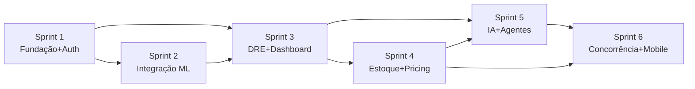

# 05 — Roadmap & Backlog

Estimativas em *story points* (referência: 1 SP ≈ meio dia de um dev sênior). Cada sprint
fecha com **CI verde, testes passando e demo funcional**. Cobertura-alvo cresce até ≥ 90% no
domínio até o Sprint 6.

---

## Sprint 1 — Fundação & Autenticação Multi-tenant

**Objetivo:** Monorepo de pé, banco modelado e migrado, autenticação completa com RBAC e
isolamento multi-tenant verificável.

**Arquivos/entregáveis principais**
- `turbo.json`, `pnpm-workspace.yaml`, `packages/config-*`
- `apps/api` (NestJS bootstrap, config tipada, health checks)
- `prisma/schema.prisma` + primeira migration + `seed.ts`
- `apps/api/src/modules/iam/**` (auth, users, companies, RBAC)
- `apps/api/src/shared/tenant/**` (TenantContext + RLS wiring)
- `apps/web` (login, signup, layout autenticado)
- `infra/docker-compose.yml`, `.github/workflows/ci.yml`

**Tarefas**
1. Setup monorepo (Turborepo + pnpm + ESLint/TS compartilhados).
2. Modelar `schema.prisma` (todas as tabelas do doc 03) + migration inicial.
3. Implementar RLS via migration SQL + middleware Prisma de tenant.
4. Auth: signup, login, JWT + refresh token rotativo, logout, Google OAuth.
5. RBAC: roles/permissions, guard `@RequirePermission`.
6. Auditoria: interceptor que grava `audit_logs`.
7. Web: telas de login/signup + sessão (TanStack Query + cookie httpOnly).
8. CI: lint + typecheck + testes + build.

**Critérios de aceite**
- Usuário cadastra empresa, faz login e recebe access+refresh token.
- Requisição sem permissão retorna 403; com permissão, 200.
- Tenant A **não** lê dados do tenant B (teste e2e prova RLS).
- Refresh token rotaciona e invalida o anterior.
- CI verde; cobertura do módulo IAM ≥ 85%.

**Estimativa:** 34 SP · **Dependências:** nenhuma.

---

## Sprint 2 — Integração Mercado Livre & Ingestão

**Objetivo:** Conectar conta ML via OAuth, sincronizar pedidos/produtos/estoque de forma
idempotente e resiliente, com SDK próprio.

**Entregáveis**
- `packages/sdk-mercadolivre/**` (cliente tipado, OAuth, retry, rate-limit)
- `apps/api/src/modules/integration/**` (accounts, OAuth callback, webhooks controller)
- `apps/workers/src/processors/ml-sync.processor.ts`
- Filas BullMQ: `ml.account.refresh`, `ml.order.fetch`, `ml.catalog.sync`

**Tarefas**
1. SDK ML: auth OAuth2, refresh, recursos (orders, items, questions, categories, users).
2. Fluxo de conexão de conta + criptografia de tokens em repouso.
3. Webhook controller idempotente (responde rápido, enfileira).
4. Worker de sync: upsert idempotente de orders/items/products/inventory.
5. Job de refresh de token agendado.
6. Backoff exponencial + dead-letter queue + espelho em `jobs`.

**Critérios de aceite**
- Conectar conta ML e importar pedidos reais (sandbox) sem duplicar.
- Reprocessar o mesmo webhook não cria registros duplicados (idempotência provada).
- Token expira e é renovado automaticamente.
- SDK com testes (mock de HTTP) ≥ 85%.

**Estimativa:** 40 SP · **Dependências:** Sprint 1.

---

## Sprint 3 — DRE Automática & Dashboard Executivo

**Objetivo:** Transformar pedidos em lucro real (DRE) e expor KPIs no dashboard.

**Entregáveis**
- `apps/api/src/modules/finance/**` (DRE, cash flow, transações)
- `apps/workers/src/processors/dre.processor.ts`
- `apps/web/app/(dashboard)/dashboard` + `/dre`
- Exportação PDF/Excel/CSV (`apps/api` + object storage)

**Tarefas**
1. Motor de DRE: receita bruta → comissões → frete → impostos → COGS → despesas → lucro.
2. Calculadora de impostos (Simples Nacional configurável por tenant).
3. Recalcule incremental disparado por `OrderImported`.
4. KPIs: receita hoje/mês, lucro, ROI, margem, ticket médio, fluxo de caixa.
5. Dashboard com Recharts: curva de vendas, sazonalidade, **curva ABC**.
6. Exportadores PDF/Excel/CSV.

**Critérios de aceite**
- DRE de um período bate com soma das transações (divergência < 1%).
- Dashboard carrega KPIs do tenant em < 1,5s (com cache Redis).
- Exporta DRE em PDF, Excel e CSV.
- Cobertura do domínio finance ≥ 90%.

**Estimativa:** 38 SP · **Dependências:** Sprints 1–2.

---

## Sprint 4 — Estoque Inteligente & IA de Precificação

**Objetivo:** Prever ruptura, sugerir reposição e calcular preços corretos.

**Entregáveis**
- `apps/api/src/modules/inventory/**` (cobertura, giro, previsão, alertas)
- `apps/api/src/modules/pricing/**` (min/ideal/break-even, ROI, markup)
- `apps/web/app/(dashboard)/estoque` + `/precos`

**Tarefas**
1. Cálculo de giro, cobertura (dias), ponto de reposição (com lead time do fornecedor).
2. Previsão de demanda (média móvel + sazonalidade; ganchos para modelo futuro).
3. Alertas de ruptura e excesso.
4. Motor de precificação: preço mínimo (não vender no prejuízo), ideal (margem-alvo), break-even, ROI, markup.
5. UI de estoque e simulador de preço.

**Critérios de aceite**
- Dado histórico, sistema indica "comprar X unidades até a data Y".
- Preço mínimo nunca resulta em margem negativa.
- Simulador recalcula em tempo real ao mudar custo/comissão.
- Cobertura dos domínios inventory e pricing ≥ 90%.

**Estimativa:** 36 SP · **Dependências:** Sprints 1–3.

---

## Sprint 5 — IA Executiva & Agentes de Negócio

**Objetivo:** Chat em linguagem natural sobre os dados reais + agentes autônomos de insight.

**Entregáveis**
- `apps/api/src/modules/ai/**` (chat, RAG sobre dados do tenant, tool-calling)
- `apps/workers/src/processors/ai-insights.processor.ts` (agentes)
- `apps/web/app/(dashboard)/ia` (chat estilo ChatGPT)

**Tarefas**
1. Camada de IA com OpenAI + **tool-calling** para consultar dados do tenant (sem alucinar números).
2. Guardrails: respostas sempre ancoradas em queries reais; citação da fonte do dado.
3. Agentes: Financeiro, Estoque, Compras, Precificação, Crescimento, Concorrência.
4. Cada agente roda agendado, gera `ai_insights` (severidade, recomendação) e dispara alertas.
5. Chat web com streaming.

**Critérios de aceite**
- "Qual produto gera mais lucro?" retorna resposta correta vinda dos dados (não inventada).
- Agente de estoque gera insight de ruptura coerente com o Sprint 4.
- Toda resposta numérica é rastreável a uma query.
- Custo de tokens monitorado por tenant.

**Estimativa:** 42 SP · **Dependências:** Sprints 3–4.

---

## Sprint 6 — Concorrência, Alertas, Mobile & Hardening

**Objetivo:** Fechar o produto: monitoramento de concorrência, canais de alerta, app mobile e
endurecimento de segurança/observabilidade.

**Entregáveis**
- `apps/api/src/modules/competition/**`
- `apps/api/src/modules/notifications/**` (WhatsApp, Email, Push)
- `apps/mobile/**` (Expo: dashboard, KPIs, alertas)
- Hardening: rate limit, headers, pen-test checklist, observabilidade completa

**Tarefas**
1. Monitoramento de concorrência: preço, avaliações, posição, ranking, histórico, alertas.
2. Notifications: provider WhatsApp + Email + Push, preferências por usuário.
3. App mobile (Expo) com login, dashboard, KPIs e push de alertas.
4. Hardening: rate limiting, Helmet, validação OWASP, revisão LGPD, backups, runbooks.
5. Observabilidade: dashboards Prometheus/Grafana, tracing, alertas de SLO.

**Critérios de aceite**
- Mudança de preço de concorrente gera histórico + alerta.
- Alerta chega por WhatsApp/Email/Push conforme preferência.
- App mobile autentica e mostra KPIs do tenant.
- Cobertura global ≥ 90%; checklist OWASP Top 10 revisado; backups testados (restore).

**Estimativa:** 44 SP · **Dependências:** Sprints 1–5.

---

## Resumo de dependências

**Total:** ~234 SP. Backlog detalhado por tarefa é mantido como issues no GitHub a partir do Sprint 1.
